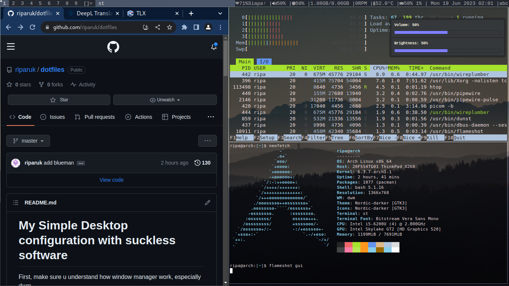

# My Simple Desktop configuration
First, make sure u understand how window manager work, especially dwm.  
The desktop configuration contains `dwm`, `dmenu`, `dwmblock`, and `st` ready to be installed.  
to install the whole thing you just run the `install.sh` script.  
to start dwm just type `startx` in terminal and hit enter.
  
Preview :  
  

